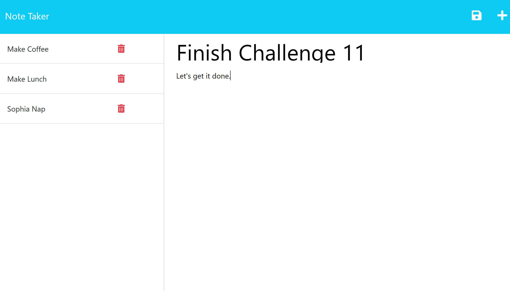

# Note-Taker

## Description
    
The Project is designed to function as a note taker to track my tasks. It is built with javascript, uses the express, fs, util, and uuid  libraries and operates through a landing HTML page with css. 
    
## Installation

Users will need to install the npm libraries as defined in the included package.json file.
Install Command:
>npm i 

## Usage

Server is initialized from command line with:
>node server.js

Notes may be added from the main(right) pane of the window. The current note may be saved my clicking the 'save' disk icon that appears once content exists for both Title and Text for the current Note. To start a new note, the '+' icon may be clicked at any time. Notes are displayed in the list(left) pane and may be deleted by clicking on the red trashcan icon to the right of each note.

Screenshot of program in use: 
 

## License

This Project is covered by the following license: GNU General Public License v3.0.

## Contributions

Starter code was provided by:  
Xander Rapstine: https://github.com/Xandromus  
John McCambridge: https://github.com/nol166  
Georga Yoo: https://github.com/Georgeyoo

Instruction was provided by Instructor Saurav with assistance from TAs Andreas #1, Andreas #2, Constan, and Morgan. 

Additionally, I used portions of the code-base provided to students in 28-Stu_Mini-Project - tailoring some of its code to our assignment. My purpose was to further familize myself with the recommended modular directory structure and the use of arrow functions to accomplish the backend assignment functionality.

## Tests

The Project may tested running 'node server.js'and then opening <http://localhost:3001> in any browser. The live site is available at: <https://morning-tor-25531.herokuapp.com/>.

## Questions

My GitHub username is JaminHLO and my repository is available here: <https://github.com/JaminHLO/>.
If you have any questions please contact me at <jamin.hogan@gmail.com>.
